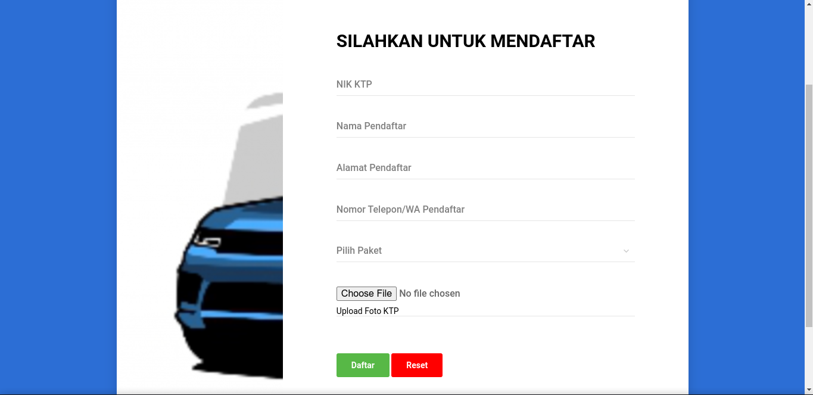
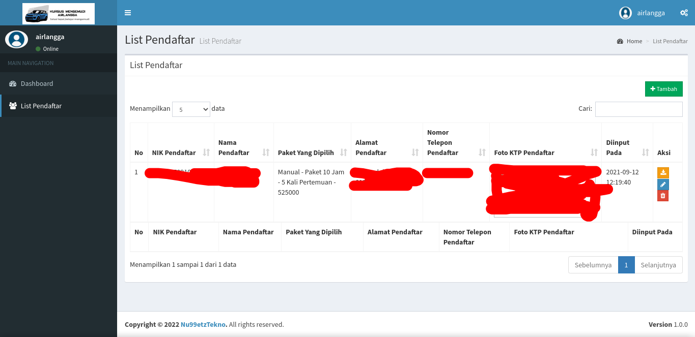
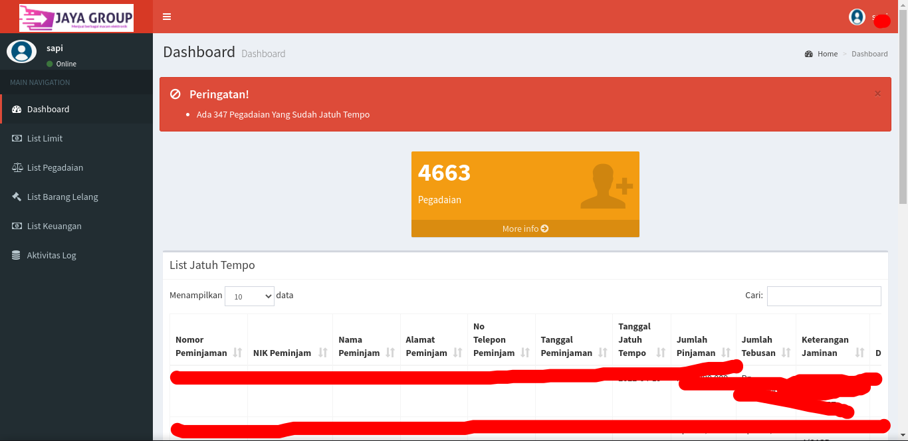
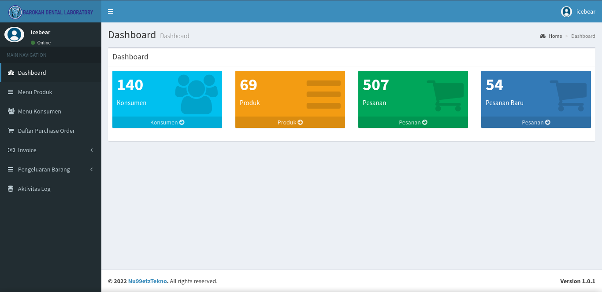
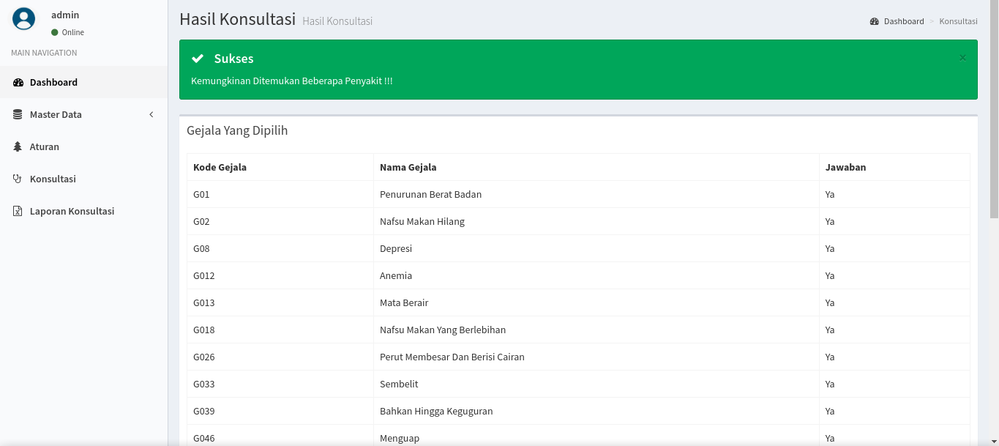
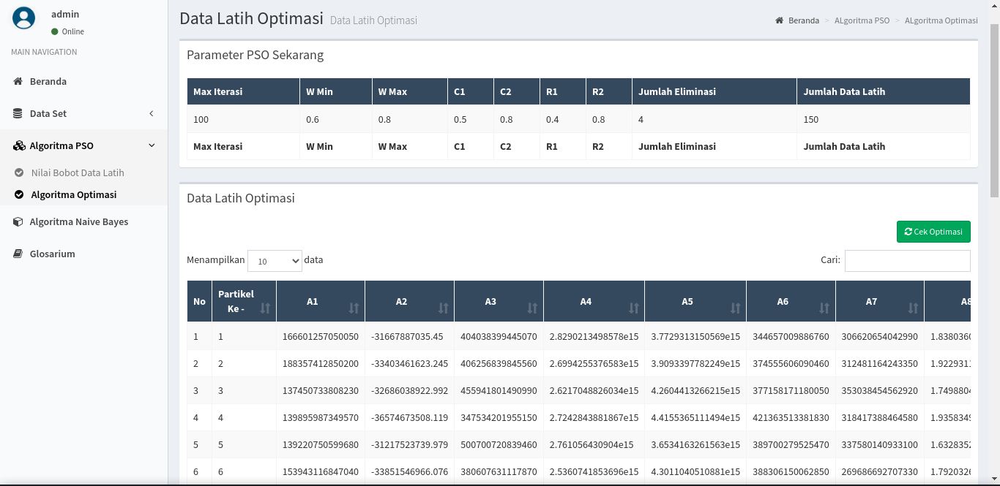

<!DOCTYPE html>
<html lang="id" class="scroll-smooth">

<head>
    <meta charset="utf-8" />
    <meta name="viewport" content="width=device-width, initial-scale=1, shrink-to-fit=no" />
    <title>Dwi Cipta Nugraha | Portofolio Web Developer</title>
    <meta name="description" content="Portofolio Web Developer & Information System Graduate - Dwi Cipta Nugraha. Keahlian dalam PHP, Laravel, Python, JavaScript, dan perancangan sistem informasi." />
    <meta name="author" content="Dwi Cipta Nugraha" />
    <link rel="icon" type="image/x-icon" href="assets/img/favicon.ico" />

    <!-- Google Fonts: Plus Jakarta Sans -->
    <link rel="preconnect" href="https://fonts.googleapis.com">
    <link rel="preconnect" href="https://fonts.gstatic.com" crossorigin>
    <link href="https://fonts.googleapis.com/css2?family=Plus+Jakarta+Sans:wght@300;400;500;600;700;800&display=swap" rel="stylesheet">

    <!-- Font Awesome 6 Icons -->
    <link rel="stylesheet" href="https://cdnjs.cloudflare.com/ajax/libs/font-awesome/6.4.2/css/all.min.css" integrity="sha512-z3gLpd7yknf1YoNbCzqRKc4qyor8gaKU1qmn+CShxbuBusANI9QpRohGBreCFkKxLhei6S9CQXFEbbKuqLg0DA==" crossorigin="anonymous" referrerpolicy="no-referrer" />

    <!-- Tailwind CSS with custom configuration -->
    
    

    <!-- Custom CSS for theme transition and styling -->
    
</head>

<body class="bg-brand-50/40 dark:bg-slate-950 text-slate-700 dark:text-slate-200 font-sans min-h-screen selection:bg-brand-200 selection:text-brand-900 dark:selection:bg-brand-900 dark:selection:text-brand-200 antialiased relative">

    <!-- Subtle Background Ambient Glows -->
    

    

    

    <!-- Mobile Top Navigation Bar -->
    <header class="lg:hidden sticky top-0 z-40 glass-nav border-b border-brand-100 dark:border-slate-800/80 px-4 py-3 flex items-center justify-between shadow-sm">
        

            
            

                <a href="#about" class="font-bold text-slate-900 dark:text-white text-sm sm:text-base leading-tight block">Dwi Cipta N.</a>
                Web Developer
            

        

        

            <!-- Theme Toggle Mobile -->
            <button class="theme-toggle-btn p-2 rounded-xl text-slate-600 dark:text-slate-300 hover:bg-brand-100 dark:hover:bg-slate-800 transition duration-200 border border-brand-200/60 dark:border-slate-700/60 shadow-xs" title="Ganti Mode Gelap/Terang" aria-label="Toggle theme">
                <i class="fas fa-sun text-amber-500 theme-icon-sun hidden text-base"></i>
                <i class="fas fa-moon text-brand-600 dark:text-brand-400 theme-icon-moon text-base"></i>
            </button>

            <!-- Hamburger Button -->
            <button id="mobileMenuBtn" class="p-2 rounded-xl text-slate-700 dark:text-slate-200 hover:bg-brand-100 dark:hover:bg-slate-800 transition duration-200 border border-brand-200/60 dark:border-slate-700/60" aria-label="Toggle navigation menu">
                <i class="fas fa-bars text-lg"></i>
            </button>
        

    </header>

    <!-- Mobile Navigation Drawer -->
    

        

            

                

                    
                    

                        <h4 class="font-bold text-slate-900 dark:text-white">Dwi Cipta Nugraha</h4>
                        
Portofolio & Resume

                    

                

                <button id="closeMobileNav" class="w-8 h-8 rounded-full bg-slate-100 dark:bg-slate-800 text-slate-500 dark:text-slate-400 flex items-center justify-center hover:bg-slate-200 dark:hover:bg-slate-700">
                    <i class="fas fa-times"></i>
                </button>
            

            <nav class="grid grid-cols-2 gap-2 pt-2">
                <a href="#about" class="mobile-nav-link flex items-center space-x-2.5 px-3 py-2.5 rounded-xl text-sm font-medium text-slate-700 dark:text-slate-200 hover:bg-brand-50 dark:hover:bg-slate-800 hover:text-brand-600">
                    <i class="fas fa-user-circle text-brand-500 w-5"></i>
                    About
                </a>
                <a href="#education" class="mobile-nav-link flex items-center space-x-2.5 px-3 py-2.5 rounded-xl text-sm font-medium text-slate-700 dark:text-slate-200 hover:bg-brand-50 dark:hover:bg-slate-800 hover:text-brand-600">
                    <i class="fas fa-graduation-cap text-brand-500 w-5"></i>
                    Education
                </a>
                <a href="#experience" class="mobile-nav-link flex items-center space-x-2.5 px-3 py-2.5 rounded-xl text-sm font-medium text-slate-700 dark:text-slate-200 hover:bg-brand-50 dark:hover:bg-slate-800 hover:text-brand-600">
                    <i class="fas fa-briefcase text-brand-500 w-5"></i>
                    Experience
                </a>
                <a href="#skills" class="mobile-nav-link flex items-center space-x-2.5 px-3 py-2.5 rounded-xl text-sm font-medium text-slate-700 dark:text-slate-200 hover:bg-brand-50 dark:hover:bg-slate-800 hover:text-brand-600">
                    <i class="fas fa-code text-brand-500 w-5"></i>
                    Skills
                </a>
                <a href="#projects" class="mobile-nav-link flex items-center space-x-2.5 px-3 py-2.5 rounded-xl text-sm font-medium text-slate-700 dark:text-slate-200 hover:bg-brand-50 dark:hover:bg-slate-800 hover:text-brand-600">
                    <i class="fas fa-laptop-code text-brand-500 w-5"></i>
                    Projects
                </a>
                <a href="#interests" class="mobile-nav-link flex items-center space-x-2.5 px-3 py-2.5 rounded-xl text-sm font-medium text-slate-700 dark:text-slate-200 hover:bg-brand-50 dark:hover:bg-slate-800 hover:text-brand-600">
                    <i class="fas fa-heart text-brand-500 w-5"></i>
                    Interests
                </a>
                <a href="#awards" class="mobile-nav-link col-span-2 flex items-center space-x-2.5 px-3 py-2.5 rounded-xl text-sm font-medium text-slate-700 dark:text-slate-200 hover:bg-brand-50 dark:hover:bg-slate-800 hover:text-brand-600">
                    <i class="fas fa-trophy text-amber-500 w-5"></i>
                    Awards & Certifications
                </a>
            </nav>

            

                Tema Tampilan:
                <button class="theme-toggle-btn flex items-center space-x-2 px-3 py-1.5 rounded-lg bg-brand-100/70 dark:bg-slate-800 text-xs font-medium text-brand-700 dark:text-brand-300">
                    <i class="fas fa-sun text-amber-500 theme-icon-sun hidden"></i>
                    <i class="fas fa-moon text-brand-600 dark:text-brand-400 theme-icon-moon"></i>
                    Mode Gelap
                </button>
            

        

    

    <!-- Desktop Fixed Sidebar -->
    <aside class="hidden lg:flex fixed inset-y-0 left-0 w-72 flex-col justify-between glass-nav border-r border-brand-200/70 dark:border-slate-800/80 p-6 z-30 shadow-sm overflow-y-auto">
        

            <!-- Profile Info & Avatar -->
            

                

                    

                    
                    
                

                <h2 class="font-bold text-lg text-slate-900 dark:text-white tracking-tight">Dwi Cipta Nugraha</h2>
                
Web Programmer

                
S.Kom - Sistem Informasi

            

            <!-- Navigation Links -->
            <nav class="mt-6 space-y-1.5" id="sideNav">
                <a href="#about" class="sidebar-nav-link flex items-center space-x-3 px-4 py-2.5 rounded-xl text-sm font-medium text-slate-600 dark:text-slate-300 hover:text-brand-600 dark:hover:text-brand-400 hover:bg-brand-100/60 dark:hover:bg-slate-800/70 transition-all duration-200">
                    <i class="fas fa-user-circle w-5 text-center text-brand-500"></i>
                    Tentang Saya
                </a>
                <a href="#education" class="sidebar-nav-link flex items-center space-x-3 px-4 py-2.5 rounded-xl text-sm font-medium text-slate-600 dark:text-slate-300 hover:text-brand-600 dark:hover:text-brand-400 hover:bg-brand-100/60 dark:hover:bg-slate-800/70 transition-all duration-200">
                    <i class="fas fa-graduation-cap w-5 text-center text-brand-500"></i>
                    Pendidikan
                </a>
                <a href="#experience" class="sidebar-nav-link flex items-center space-x-3 px-4 py-2.5 rounded-xl text-sm font-medium text-slate-600 dark:text-slate-300 hover:text-brand-600 dark:hover:text-brand-400 hover:bg-brand-100/60 dark:hover:bg-slate-800/70 transition-all duration-200">
                    <i class="fas fa-briefcase w-5 text-center text-brand-500"></i>
                    Pengalaman
                </a>
                <a href="#skills" class="sidebar-nav-link flex items-center space-x-3 px-4 py-2.5 rounded-xl text-sm font-medium text-slate-600 dark:text-slate-300 hover:text-brand-600 dark:hover:text-brand-400 hover:bg-brand-100/60 dark:hover:bg-slate-800/70 transition-all duration-200">
                    <i class="fas fa-code w-5 text-center text-brand-500"></i>
                    Keahlian (Skills)
                </a>
                <a href="#projects" class="sidebar-nav-link flex items-center space-x-3 px-4 py-2.5 rounded-xl text-sm font-medium text-slate-600 dark:text-slate-300 hover:text-brand-600 dark:hover:text-brand-400 hover:bg-brand-100/60 dark:hover:bg-slate-800/70 transition-all duration-200">
                    <i class="fas fa-laptop-code w-5 text-center text-brand-500"></i>
                    Proyek Portfolio
                </a>
                <a href="#interests" class="sidebar-nav-link flex items-center space-x-3 px-4 py-2.5 rounded-xl text-sm font-medium text-slate-600 dark:text-slate-300 hover:text-brand-600 dark:hover:text-brand-400 hover:bg-brand-100/60 dark:hover:bg-slate-800/70 transition-all duration-200">
                    <i class="fas fa-heart w-5 text-center text-brand-500"></i>
                    Minat & Hobi
                </a>
                <a href="#awards" class="sidebar-nav-link flex items-center space-x-3 px-4 py-2.5 rounded-xl text-sm font-medium text-slate-600 dark:text-slate-300 hover:text-brand-600 dark:hover:text-brand-400 hover:bg-brand-100/60 dark:hover:bg-slate-800/70 transition-all duration-200">
                    <i class="fas fa-trophy w-5 text-center text-amber-500"></i>
                    Penghargaan
                </a>
            </nav>
        

        <!-- Sidebar Footer & Dark Mode Switch -->
        

            <!-- Dark Mode Toggle Button -->
            <button class="theme-toggle-btn w-full flex items-center justify-between px-3.5 py-2.5 rounded-xl bg-white/80 dark:bg-slate-900 border border-brand-200/80 dark:border-slate-800 shadow-xs hover:border-brand-400 dark:hover:border-slate-700 transition duration-200 group text-slate-700 dark:text-slate-300">
                
                    <i class="fas fa-moon text-brand-600 dark:text-brand-400 theme-icon-moon"></i>
                    <i class="fas fa-sun text-amber-500 theme-icon-sun hidden"></i>
                    Mode Gelap
                
                Toggle
            </button>

            <!-- Social Links -->
            

                <a href="https://github.com/nu99etz" target="_blank" rel="noopener noreferrer" class="w-8 h-8 rounded-lg flex items-center justify-center hover:bg-brand-100 dark:hover:bg-slate-800 hover:text-brand-600 dark:hover:text-brand-400 transition" title="GitHub Profile">
                    <i class="fab fa-github text-base"></i>
                </a>
                <a href="https://www.linkedin.com/in/dwi-cipta-nugraha-49bb641a5/" target="_blank" rel="noopener noreferrer" class="w-8 h-8 rounded-lg flex items-center justify-center hover:bg-brand-100 dark:hover:bg-slate-800 hover:text-brand-600 dark:hover:text-brand-400 transition" title="LinkedIn Profile">
                    <i class="fab fa-linkedin-in text-base"></i>
                </a>
                <a href="https://www.facebook.com/dwicipta.nugraha.54/" target="_blank" rel="noopener noreferrer" class="w-8 h-8 rounded-lg flex items-center justify-center hover:bg-brand-100 dark:hover:bg-slate-800 hover:text-brand-600 dark:hover:text-brand-400 transition" title="Facebook">
                    <i class="fab fa-facebook-f text-base"></i>
                </a>
                <a href="mailto:dwiciptan99@gmail.com" class="w-8 h-8 rounded-lg flex items-center justify-center hover:bg-brand-100 dark:hover:bg-slate-800 hover:text-brand-600 dark:hover:text-brand-400 transition" title="Kirim Email">
                    <i class="fas fa-envelope text-base"></i>
                </a>
            

            

                © 2026 Dwi Cipta Nugraha
            

        

    </aside>

    <!-- Main Content Area -->
    <main class="lg:pl-72 min-h-screen">
        

            <!-- 1. ABOUT SECTION -->
            <section id="about" class="scroll-mt-24">
                

                    <!-- Top accent banner decoration -->
                    

                    <!-- Greeting Badge -->
                    

                        
                        Fullstack & Web Developer Enthusiast
                    

                    <!-- Name Headline -->
                    <h1 class="text-3xl sm:text-5xl font-extrabold text-slate-900 dark:text-white tracking-tight leading-tight">
                        Dwi Cipta Nugraha
                    </h1>

                    <!-- Contact & Info Pills -->
                    

                        
                            <i class="fas fa-map-marker-alt text-brand-500"></i>
                            Surabaya, Jawa Timur (60285)
                        
                        <a href="tel:082234073315" class="inline-flex items-center space-x-1.5 bg-slate-100/80 dark:bg-slate-800/80 px-3 py-1.5 rounded-lg border border-slate-200/60 dark:border-slate-700/60 hover:border-brand-400 hover:text-brand-600 dark:hover:text-brand-400 transition">
                            <i class="fas fa-phone text-brand-500"></i>
                            0822-3407-3315
                        </a>
                        <a href="mailto:dwiciptan99@gmail.com" class="inline-flex items-center space-x-1.5 bg-slate-100/80 dark:bg-slate-800/80 px-3 py-1.5 rounded-lg border border-slate-200/60 dark:border-slate-700/60 hover:border-brand-400 hover:text-brand-600 dark:hover:text-brand-400 transition">
                            <i class="fas fa-envelope text-brand-500"></i>
                            dwiciptan99@gmail.com
                        </a>
                    

                    <!-- Bio Lead Paragraph -->
                    

                        

                            Halo! Nama saya <strong class="text-slate-900 dark:text-white font-semibold">Dwi Cipta Nugraha</strong>, lahir di Surabaya pada 8 Agustus 1999. Lulusan Sarjana Komputer (S1 Sistem Informasi) dari <strong class="text-brand-600 dark:text-brand-400">Institut Teknologi Adhi Tama Surabaya (ITATS)</strong> dengan predikat memuaskan (GPA 3.73).
                        

                        

                            Memiliki pengalaman sebagai <strong class="text-slate-800 dark:text-slate-100">Freelance Web Programmer</strong> serta pengalaman magang di software house PT Sentra Vidya Utama. Terbiasa membangun aplikasi sistem informasi berbasis web, mengoptimalkan database, melakukan debugging, serta cepat mempelajari teknologi baru dan solid berkolaborasi dalam tim.
                        

                    

                    <!-- Action Buttons & Social Links -->
                    

                        

                            <a href="mailto:dwiciptan99@gmail.com" class="inline-flex items-center space-x-2 px-5 py-2.5 rounded-xl bg-gradient-to-r from-brand-600 to-cyan-600 hover:from-brand-500 hover:to-cyan-500 text-white text-xs sm:text-sm font-semibold shadow-md shadow-brand-500/20 hover:shadow-brand-500/30 hover:-translate-y-0.5 transition duration-200">
                                <i class="fas fa-paper-plane"></i>
                                Hubungi Saya
                            </a>
                            <a href="#projects" class="inline-flex items-center space-x-2 px-5 py-2.5 rounded-xl bg-white dark:bg-slate-800 hover:bg-brand-50 dark:hover:bg-slate-700 text-slate-800 dark:text-slate-200 text-xs sm:text-sm font-semibold border border-slate-200 dark:border-slate-700 hover:border-brand-300 dark:hover:border-slate-600 transition duration-200">
                                <i class="fas fa-eye text-brand-500"></i>
                                Lihat Portofolio
                            </a>
                        

                        <!-- Social Icon Pills -->
                        

                            <a href="https://github.com/nu99etz" target="_blank" rel="noopener noreferrer" class="w-10 h-10 rounded-xl bg-slate-100 dark:bg-slate-800 flex items-center justify-center text-slate-700 dark:text-slate-300 hover:bg-brand-600 hover:text-white dark:hover:bg-brand-500 dark:hover:text-white transition duration-200 shadow-xs" title="GitHub">
                                <i class="fab fa-github text-lg"></i>
                            </a>
                            <a href="https://www.linkedin.com/in/dwi-cipta-nugraha-49bb641a5/" target="_blank" rel="noopener noreferrer" class="w-10 h-10 rounded-xl bg-slate-100 dark:bg-slate-800 flex items-center justify-center text-slate-700 dark:text-slate-300 hover:bg-blue-600 hover:text-white dark:hover:bg-blue-500 dark:hover:text-white transition duration-200 shadow-xs" title="LinkedIn">
                                <i class="fab fa-linkedin-in text-lg"></i>
                            </a>
                            <a href="https://www.facebook.com/dwicipta.nugraha.54/" target="_blank" rel="noopener noreferrer" class="w-10 h-10 rounded-xl bg-slate-100 dark:bg-slate-800 flex items-center justify-center text-slate-700 dark:text-slate-300 hover:bg-blue-700 hover:text-white dark:hover:bg-blue-600 dark:hover:text-white transition duration-200 shadow-xs" title="Facebook">
                                <i class="fab fa-facebook-f text-lg"></i>
                            </a>
                        

                    

                

            </section>

            <!-- 2. EDUCATION SECTION -->
            <section id="education" class="scroll-mt-24 space-y-6">
                

                    

                        <i class="fas fa-graduation-cap text-lg"></i>
                    

                    

                        <h2 class="text-2xl font-bold text-slate-900 dark:text-white">Pendidikan (Education)</h2>
                        
Riwayat studi akademik dan kualifikasi

                    

                

                

                    

                        

                            <h3 class="text-lg font-bold text-slate-900 dark:text-white group-hover:text-brand-600 dark:group-hover:text-brand-400 transition">
                                Institut Teknologi Adhi Tama Surabaya (ITATS)
                            </h3>
                            

                                Sarjana Komputer (S.Kom)
                                •
                                Sistem Informasi
                            

                        

                        

                            
                                2017 - 2021
                            
                        

                    

                    

                        

                            <i class="fas fa-star text-amber-400"></i>
                            IPK / GPA: <strong>3.73 / 4.00</strong>
                        

                        

                            Fokus: Rekayasa Perangkat Lunak, Basis Data, dan Sistem Informasi Manajemen.
                        

                    

                

            </section>

            <!-- 3. EXPERIENCE SECTION -->
            <section id="experience" class="scroll-mt-24 space-y-6">
                

                    

                        <i class="fas fa-briefcase text-lg"></i>
                    

                    

                        <h2 class="text-2xl font-bold text-slate-900 dark:text-white">Pengalaman Kerja (Experience)</h2>
                        
Rekam jejak profesional & proyek freelance

                    

                

                

                    <!-- Exp 1: Freelance -->
                    

                        

                            

                                

                                    <h3 class="text-lg font-bold text-slate-900 dark:text-white">Freelance Web Programmer</h3>
                                    Aktif
                                

                                
Personal Work / Project-Based

                            

                            
                                April 2020 - Sekarang
                            
                        

                        

                            Bekerja secara independen membangun dan mengembangkan berbagai aplikasi sistem berbasis web sesuai kebutuhan spesifik klien. Menangani perancangan arsitektur database, pembuatan modul backend, antarmuka pengguna responsif, serta deployment sistem.
                        

                    

                    <!-- Exp 2: PT Sentra Vidya Utama -->
                    

                        

                            

                                <h3 class="text-lg font-bold text-slate-900 dark:text-white">Internship Web Programmer</h3>
                                
PT Sentra Vidya Utama (SEVIMA)

                            

                            
                                Januari 2020 - April 2020
                            
                        

                        <ul class="mt-4 space-y-2 text-sm text-slate-600 dark:text-slate-300">
                            <li class="flex items-start space-x-2">
                                <i class="fas fa-check-circle text-brand-500 mt-1 text-xs"></i>
                                Mengembangkan modul pada Sistem Informasi Akademik Perguruan Tinggi.
                            </li>
                            <li class="flex items-start space-x-2">
                                <i class="fas fa-check-circle text-brand-500 mt-1 text-xs"></i>
                                Melakukan pengujian sistem (testing) serta perbaikan bug (bug fixing) pada aplikasi akademik.
                            </li>
                            <li class="flex items-start space-x-2">
                                <i class="fas fa-check-circle text-brand-500 mt-1 text-xs"></i>
                                Menambahkan modul pelaporan dinamis (Export Excel, Word, PDF, dan HTML).
                            </li>
                        </ul>
                    

                    <!-- Exp 3: Rumah Photo -->
                    

                        

                            

                                <h3 class="text-lg font-bold text-slate-900 dark:text-white">Internship Photographer</h3>
                                
Rumah Photo

                            

                            
                                Februari 2016 - April 2016
                            
                        

                        <ul class="mt-4 space-y-2 text-sm text-slate-600 dark:text-slate-300">
                            <li class="flex items-start space-x-2">
                                <i class="fas fa-check-circle text-brand-500 mt-1 text-xs"></i>
                                Fotografi Pre-Wedding & Wedding event.
                            </li>
                            <li class="flex items-start space-x-2">
                                <i class="fas fa-check-circle text-brand-500 mt-1 text-xs"></i>
                                Pemotretan model dan pengeditan hasil foto.
                            </li>
                        </ul>
                    

                

            </section>

            <!-- 4. SKILLS SECTION -->
            <section id="skills" class="scroll-mt-24 space-y-6">
                

                    

                        <i class="fas fa-code text-lg"></i>
                    

                    

                        <h2 class="text-2xl font-bold text-slate-900 dark:text-white">Keahlian & Teknologi (Skills)</h2>
                        
Bahasa pemrograman, framework, dan alur kerja pengembangan

                    

                

                

                    <!-- Programming Languages -->
                    

                        <h3 class="text-sm font-bold uppercase tracking-wider text-slate-900 dark:text-white flex items-center space-x-2">
                            <i class="fas fa-terminal text-brand-500"></i>
                            Bahasa Pemrograman & Framework
                        </h3>
                        

                            
                                <i class="fab fa-php text-indigo-500 text-sm"></i>
                                PHP
                            
                            
                                <i class="fab fa-laravel text-red-500 text-sm"></i>
                                Laravel
                            
                            
                                <i class="fab fa-python text-blue-500 text-sm"></i>
                                Python
                            
                            
                                <i class="fab fa-js-square text-amber-500 text-sm"></i>
                                JavaScript
                            
                            
                                <i class="fab fa-html5 text-orange-500 text-sm"></i>
                                HTML5
                            
                            
                                <i class="fab fa-css3-alt text-blue-600 text-sm"></i>
                                CSS3
                            
                        

                    

                    <!-- Workflow & Methodology -->
                    

                        <h3 class="text-sm font-bold uppercase tracking-wider text-slate-900 dark:text-white flex items-center space-x-2">
                            <i class="fas fa-tasks text-cyan-500"></i>
                            Workflow & Metodologi
                        </h3>
                        

                            

                                
                                    <i class="fas fa-check text-xs"></i>
                                
                                Cross Browser Testing & Debugging
                            

                            

                                
                                    <i class="fas fa-check text-xs"></i>
                                
                                Scrum & Agile Development
                            

                            

                                
                                    <i class="fas fa-check text-xs"></i>
                                
                                Database Design & Query Optimization (MySQL)
                            

                        

                    

                

            </section>

            <!-- 5. PROJECTS SECTION -->
            <section id="projects" class="scroll-mt-24 space-y-6">
                

                    

                        

                            <i class="fas fa-laptop-code text-lg"></i>
                        

                        

                            <h2 class="text-2xl font-bold text-slate-900 dark:text-white">Proyek Portofolio (Projects)</h2>
                            
Hasil karya sistem informasi dan aplikasi web yang telah dibangun

                        

                    

                

                

                    <!-- Project 1: Kursus Mobil -->
                    

                        

                            

                                
                                
                            

                            

                                

                                    Web Information System
                                

                                <h3 class="font-bold text-base text-slate-900 dark:text-white leading-snug">
                                    Sistem Informasi Pendaftaran Kursus Mobil Airlangga
                                </h3>
                                

                                    Sistem pendaftaran kursus mobil berbasis web untuk mengelola registrasi peserta, konfirmasi berkas pemohon, hingga pengelolaan jadwal kursus oleh admin.
                                

                            

                        

                        

                            PHP • MySQL • Bootstrap
                            Screenshot Ready
                        

                    

                    <!-- Project 2: Pegadaian Jaya Group Bima -->
                    

                        

                            

                                
                            

                            

                                Finance & Pawnshop
                                <h3 class="font-bold text-base text-slate-900 dark:text-white leading-snug">
                                    Sistem Informasi Pegadaian Jaya Group Bima
                                </h3>
                                

                                    Sistem informasi pegadaian berbasis web untuk pendataan barang gadai, perpanjangan masa gadai, hitung bunga transaksi, hingga lelang barang jatuh tempo.
                                

                            

                        

                        

                            Laravel • MySQL
                            Screenshot Ready
                        

                    

                    <!-- Project 3: Dental Barokah Laboratory -->
                    

                        

                            

                                
                            

                            

                                Manufacturing & Lab
                                <h3 class="font-bold text-base text-slate-900 dark:text-white leading-snug">
                                    Dental Barokah Laboratory
                                </h3>
                                

                                    Sistem manufaktur dental untuk menangani pre-order pembuatan gigi tiruan, monitoring tahapan produksi laboratorium, dan rekapitulasi tagihan dokter gigi.
                                

                            

                        

                        

                            PHP • MySQL • JS
                            Screenshot Ready
                        

                    

                    <!-- Project 4: Skripsi Sistem Pakar Kucing -->
                    

                        

                            

                                
                            

                            

                                Expert System • AI
                                <h3 class="font-bold text-base text-slate-900 dark:text-white leading-snug">
                                    Sistem Pakar Pendeteksi Penyakit Kucing
                                </h3>
                                

                                    Aplikasi sistem pakar berbasis web untuk mendiagnosis jenis penyakit pada kucing berdasarkan gejala klinis menggunakan metode Forward Chaining.
                                

                            

                        

                        

                            Forward Chaining • PHP
                            Screenshot Ready
                        

                    

                    <!-- Project 5: Optimasi Data Latih PSO & Naive Bayes -->
                    

                        

                            
                        

                        

                            

                                Data Mining & Optimization
                                <h3 class="font-bold text-base sm:text-lg text-slate-900 dark:text-white leading-snug">
                                    Sistem Informasi Optimasi Data Latih (PSO & Naive Bayes)
                                </h3>
                                

                                    Sistem informasi optimasi data latih berbasis web yang mengkombinasikan dua metode algoritma cerdas, yaitu Particle Swarm Optimization (PSO) untuk reduksi atribut dan Naive Bayes untuk klasifikasi data.
                                

                            

                            

                                Python / Web • PSO • Naive Bayes
                                Research & Dev
                            

                        

                    

                

            </section>

            <!-- 6. INTERESTS SECTION -->
            <section id="interests" class="scroll-mt-24 space-y-6">
                

                    

                        <i class="fas fa-heart text-lg"></i>
                    

                    

                        <h2 class="text-2xl font-bold text-slate-900 dark:text-white">Minat & Hobi (Interests)</h2>
                        
Aktivitas dan kegemaran di luar waktu coding

                    

                

                

                    

                        

                            <i class="fas fa-futbol text-lg"></i>
                        

                        <h3 class="font-bold text-slate-900 dark:text-white text-base">Olahraga & Outdoor</h3>
                        

                            Di samping menggeluti pemrograman web, saya senang menghabiskan waktu di luar ruangan bermain sepak bola dan cricket bersama rekan-rekan.
                        

                    

                    

                        

                            <i class="fas fa-tv text-lg"></i>
                        

                        <h3 class="font-bold text-slate-900 dark:text-white text-base">Tayangan Olahraga & Cricket</h3>
                        

                            Saat berada di dalam ruangan, saya suka menyaksikan siaran turnamen olahraga, khususnya pertandingan cricket favorit internasional.
                        

                    

                

            </section>

            <!-- 7. AWARDS & CERTIFICATIONS SECTION -->
            <section id="awards" class="scroll-mt-24 space-y-6">
                

                    

                        <i class="fas fa-trophy text-lg"></i>
                    

                    

                        <h2 class="text-2xl font-bold text-slate-900 dark:text-white">Penghargaan (Awards & Certifications)</h2>
                        
Prestasi akademik dan sertifikasi magang

                    

                

                

                    <!-- Award 1 -->
                    

                        

                            

                                <i class="fas fa-award text-2xl"></i>
                            

                            

                                Tahun 2021
                                <h3 class="font-bold text-slate-900 dark:text-white text-sm sm:text-base leading-snug">
                                    Best Student Bachelor Of Computer
                                </h3>
                                

                                    Department of Information System, Institut Teknologi Adhi Tama Surabaya.
                                

                            

                        

                    

                    <!-- Award 2 -->
                    

                        

                            

                                <i class="fas fa-certificate text-2xl"></i>
                            

                            

                                Tahun 2020
                                <h3 class="font-bold text-slate-900 dark:text-white text-sm sm:text-base leading-snug">
                                    Internship Web Programmer Certificate
                                </h3>
                                

                                    PT Sentra Vidya Utama (SEVIMA) - Surabaya.
                                

                            

                        

                    

                

            </section>

            <!-- Bottom Contact Banner -->
            <section class="glass-card rounded-3xl p-8 border border-brand-200 dark:border-slate-800 text-center space-y-4 relative overflow-hidden bg-gradient-to-br from-brand-50 via-white to-sky-100 dark:from-slate-900 dark:via-slate-900 dark:to-slate-800">
                

                    <i class="fas fa-handshake text-xl"></i>
                

                <h2 class="text-xl sm:text-2xl font-bold text-slate-900 dark:text-white">Tertarik Bekerja Sama?</h2>
                

                    Saya terbuka untuk peluang kerja full-time, freelance, maupun kolaborasi proyek web development.
                

                

                    <a href="mailto:dwiciptan99@gmail.com" class="inline-flex items-center space-x-2 px-6 py-3 rounded-xl bg-brand-600 hover:bg-brand-500 text-white text-sm font-semibold shadow-md shadow-brand-500/30 hover:-translate-y-0.5 transition duration-200">
                        <i class="fas fa-envelope"></i>
                        dwiciptan99@gmail.com
                    </a>
                

            </section>

            <!-- Footer -->
            <footer class="pt-6 pb-12 border-t border-slate-200/80 dark:border-slate-800 text-center text-xs text-slate-400 dark:text-slate-500 flex flex-col sm:flex-row items-center justify-between gap-3">
                
© 2026 Dwi Cipta Nugraha • Portofolio Web

                

                    <a href="#about" class="hover:text-brand-600 dark:hover:text-brand-400 transition">Kembali ke Atas <i class="fas fa-arrow-up ml-1"></i></a>
                

            </footer>

        

    </main>

    <!-- Image Lightbox Modal -->
    

        

        

            

                
Screenshot Proyek

                <button id="modalCloseBtn" class="w-8 h-8 rounded-full bg-slate-200 dark:bg-slate-800 text-slate-600 dark:text-slate-300 hover:bg-slate-300 dark:hover:bg-slate-700 flex items-center justify-center transition" aria-label="Tutup preview">
                    <i class="fas fa-times"></i>
                </button>
            

            

                
            

        

    

    <!-- Core interactive scripts -->
    
</body>

</html>